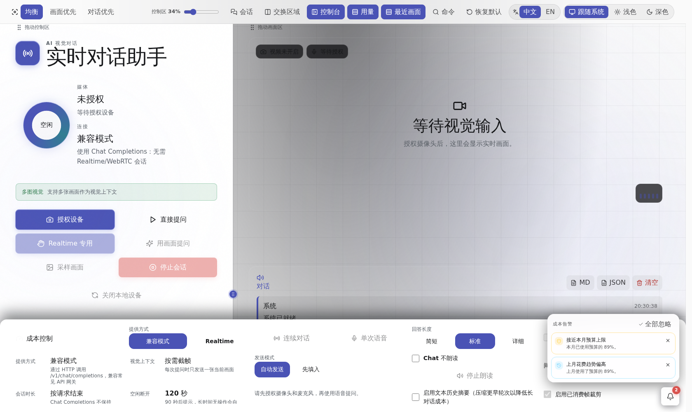
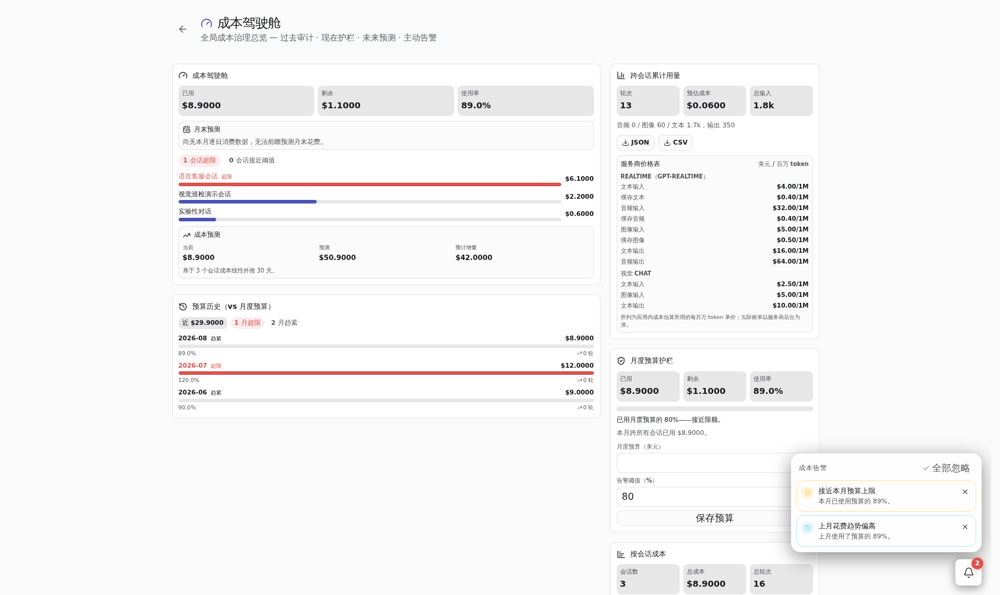
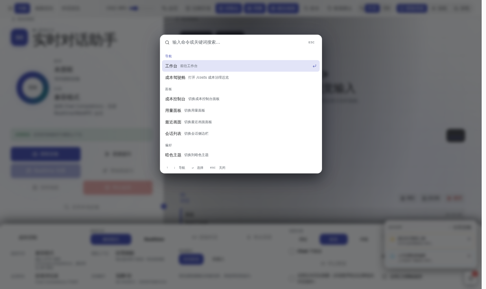
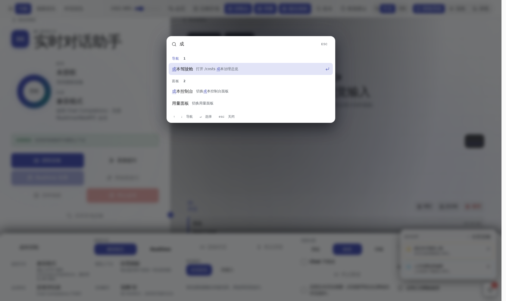
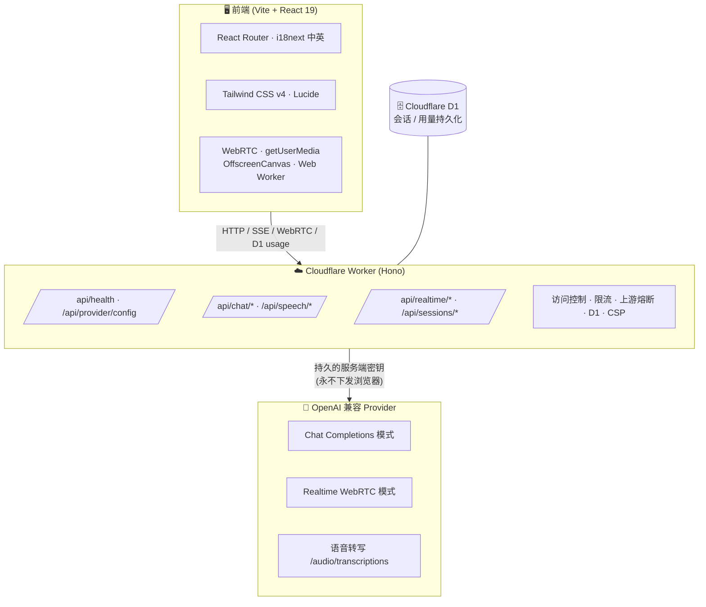
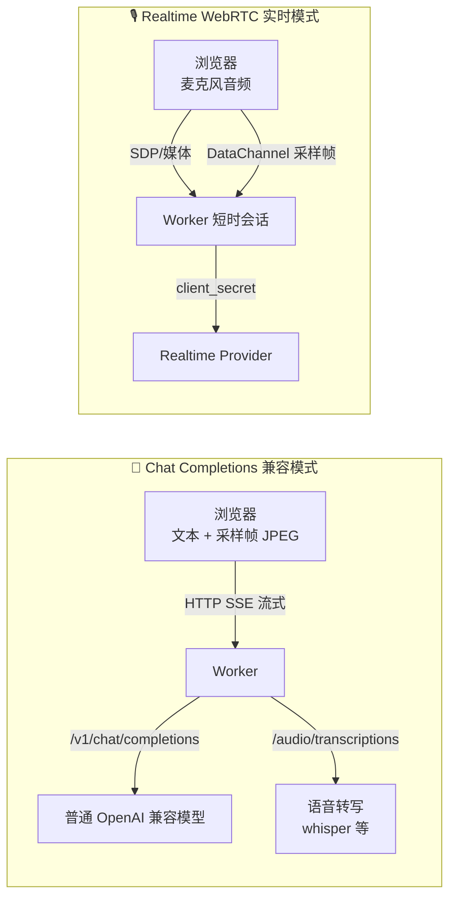
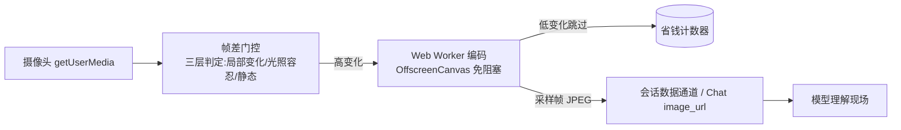
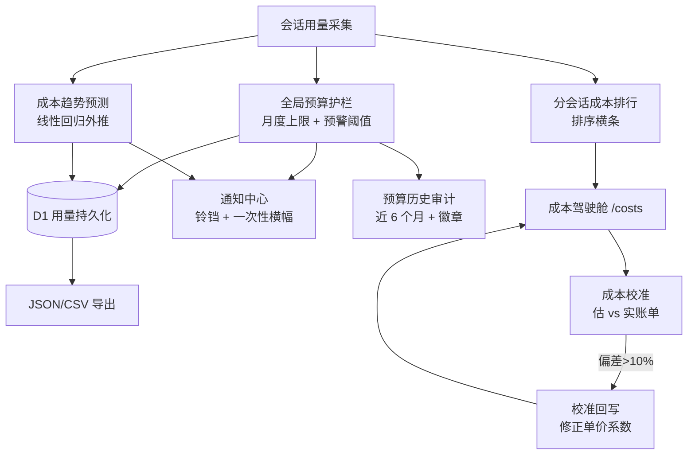

<p align="center">
  
</p>

<h1 align="center">AI Visual Dialogue Assistant</h1>

<p align="center">
  一个「看得见、听得懂、花得省」的浏览器实时 AI 助手 —— 集成摄像头视觉上下文、麦克风语音交互与云端大模型回答，并内置一整套<b>成本治理</b>能力。
</p>

<p align="center">
  
  
  
  
  
  
  
  
</p>

<p align="center">
  <b>视觉对话</b> · <b>语音实时</b> · <b>成本驾驶舱</b> · <b>桌面终端</b> · <b>成本校准</b>
</p>

---

## ✨ 这是什么？

这是一款浏览器/桌面端的 **AI 视觉对话助手**。打开摄像头，它就能「看」到你的现场画面；对着麦克风说话，它就能实时应答 —— 而你的模型密钥始终安全地保留在服务端。

项目最大的特色是**把「花钱」这件事做到了极致透明与可控**：每一次对话的真实 token 用量、每一分钱的花费、每一个月的预算、甚至前端估算与厂商账单的偏差，都被量化、可视化并可一键校准。


---

## 📸 界面实拍

> 以下均为**实际运行的界面截图**（前端纯 mock API，无需模型密钥即可复现）。

### 工作台首页 —— 视觉对话 + 语音 + 成本控制一屏尽览

<p align="center">
  
</p>

> 左侧为实时媒体区（摄像头 / 麦克风），中部为会话控制与文本输入，右侧为成本控制台与用量/成本面板；顶部工具栏含成本告警铃铛、全局命令面板入口与主题/语言切换。

### 成本驾驶舱 `/costs` —— 全链路成本治理

<p align="center">
  
</p>

> 月度预算护栏（已用 / 剩余 / 使用率）、逐会话成本排行（超限 / 接近阈值徽章）、月末外推预测、预算历史审计、跨会话用量与成本对比一页聚合。

### 全局命令面板 —— `Ctrl/Cmd + K` 键盘优先交互

| 打开命令面板（浏览全部分组） | 输入过滤实时检索 |
| :---: | :---: |
|  |  |

---

## 🗺️ 架构总览




> 前端只拿短时令牌与会话级凭据；永久 API Key 始终保留在服务端，浏览器永不接触。

### 两种对话模式



- **Chat Completions 兼容模式**：面向绝大多数第三方 OpenAI 兼容站点（只支持 `/v1/chat/completions`），文本 + 可选采样帧，SSE 增量渲染，语音输入可先转写再送入对话。
- **Realtime 实时模式**：面向支持短时会话 + WebRTC SDP 交换的提供方，真正的低延迟语音流式交互，支持服务端 VAD 与按键说话两种打断方式。

### 视觉上下文采样（为省钱而设计）



---

## 🎯 核心特性

### 1️⃣ 视觉 + 语音的实时交互

- 🎥 **实时摄像头预览**：`getUserMedia` 授权后即可看到现场画面。
- 🎤 **实时语音对话**（Realtime）：WebRTC 低延迟收发音频。
- ✋ **按键说话 / 服务端 VAD**：适配嘈杂环境，支持一键静音开关。
- 🖼️ **采样帧进上下文**：手动 / 低频自动采样 JPEG 帧，随会话发送给模型理解现场。
- 🔇 **纯文本应答**：可请求仅文本回复，避开最贵的音频输出。
- ⌨️ **文字提问**：会话中随时输入文字，适合多模态结合。

### 2️⃣ 为「省钱」而生的智能采样

- ⚡ **帧差门控**：三层判定（局部单元格变化 → 光照容忍全局变化 → 静态），只上传真正变化的画面，附 可见的 sent/skipped 计数器。
- 🧵 **主线程零阻塞**：Web Worker + OffscreenCanvas 处理像素读回与 JPEG 编码。
- 🧹 **历史剪枝**：消费过的帧只计费一次，避免后续轮次重复扣费。
- 📜 **文本历史摘要**：把早期轮次压缩成低成本上下文注入，阻止长对话的 token 雪球。

### 3️⃣ 全链路成本治理（成本驾驶舱）



- 📊 **会话用量仪表**：`response.done` 权威事件 → 模态分桶（音频入/出、图像、文本）→ USD 估算。
- 🛡️ **会话预算护栏**：可设单会话成本上限，进度条 80% 预警、100% 超支报警。
- 🗓️ **月度预算护栏**：月度上限 + 预警阈值，横条展示已用/剩余/占比，warn/over 状态徽章。
- 📈 **成本趋势预测**：当前会话累计成本做线性回归外推（月末 / 下月 / 固定天数）。
- 🏁 **月末支出预测**：按每日花费拟合外推，给出 on-track / at-risk / over-budget 徽章。
- 🧮 **成本校准**：录入厂商真实账单，实时对比前端估算偏差，偏差 >10% 时一键**回写修正系数**，让估算贴合实测账单，并全局生效。
- 🔍 **成本驾驶舱页（`/costs`）**：全屏汇总护栏 / 排行 / 预测 / 历史 / 对比，一处回答「钱花到哪、谁花最多、会不会超」。
- 🔔 **通知中心**：护栏告警、月末预测风险、历史超支等信号折叠为铃铛通知，可逐条/全部忽略。

### 4️⃣ 生产效率与体验

- ⌨️ **全局命令面板** `Ctrl/Cmd+K`：跨页面模糊搜索、导航、开关面板、切换主题/语言、重置布局。
- 🎹 **全局快捷键配置**：所有可绑定命令均可重绑并持久化。
- 🔔 **桌面通知**：Web Notifications，浏览器与 Tauri 桌面端通用。
- 🖥️ **Tauri 原生桌面**：内置 xterm.js 交互式终端、窗口控制、系统信息。
- 🌗 **暗 / 亮双主题**：Deep-Space 深空环境光语言，双主题均达 **WCAG AA** 对比度（axe 自动审计锁定）。
- 🌍 **中 / 英双语**：i18next，语言切换持久化到 localStorage。

---

## 🛠️ 技术栈

| 层 | 技术 |
| --- | --- |
| **前端框架** | React 19 · React Router · TypeScript 5 |
| **样式** | Tailwind CSS v4 · Lucide React 图标 |
| **构建 / 引擎** | Vite 6 · Cloudflare Workers + Hono |
| **实时音视频** | WebRTC · getUserMedia · OffscreenCanvas · xterm.js |
| **桌面端** | Tauri 2 · @tauri-apps/api |
| **数据持久化** | Cloudflare D1（会话 / 用量） |
| **测试** | Vitest（含 Worker / Durable Object）· Playwright E2E · axe-core a11y |
| **上游韧性** | Worker 平台 API（限流 + 熔断 + 重试，无第三方运行时依赖） |

---

## 🚀 快速开始

### 环境要求

- **Node.js 24+**
- **pnpm 11.6.0**（通过 Corepack）

```bash
corepack enable
corepack prepare pnpm@11.6.0 --activate
```

### 安装并启动

```bash
corepack pnpm install
corepack pnpm dev
```

前端运行在 Vite 打印的地址（通常 `http://localhost:5173`）。未配置模型密钥时工作台仍可正常使用，真实模型调用需服务端密钥（见下方「环境变量」）。

### 一键演示自检

```powershell
.\scripts\verify-demo.ps1 -RunInstall      # 完整演示前自检
.\scripts\verify-demo.ps1 -SkipQuality -SkipBuild   # 快速冒烟
```

详见 [`docs/demo-verification.md`](docs/demo-verification.md)。

---

## 🌩️ Worker 后端开发

### 启动 Worker（端到端 API + Realtime 测试）

```bash
corepack pnpm dev:worker
```

健康检查：

```bash
curl http://localhost:8787/api/health
```

Realtime 会话检查：

```bash
curl -X POST http://localhost:8787/api/realtime/session \
  -H "Content-Type: application/json" \
  -d '{"visualContextMode":"manual","turnDetectionMode":"server-vad"}'
```

Chat Completions 检查：

```bash
curl -X POST http://localhost:8787/api/chat/completion \
  -H "Content-Type: application/json" \
  -d '{"message":"hello","responseBudget":"brief"}'
```

### 上游韧性（Upstream Resilience）

所有 Worker → Provider 调用共享一套可靠性策略：

| 机制 | 说明 |
| --- | --- |
| ⏱️ **超时** | Chat 30s · Realtime 会话创建 15s · 转写 45s |
| 🔁 **重试** | 至多 2 次；仅 `408/429/500/502/503/504`、超时与网络错误 |
| 🆔 **幂等** | 两次尝试复用同一 `Idempotency-Key` |
| 🧯 **熔断器** | SQLite 持久化 Durable Object，按 provider 源 + 操作分片；3 次失败开闸 → 20s 等待 → 半开探测 → 60s 冷却 |
| 📦 **响应边界** | Provider 响应体有界，绝不复制进公开错误 |
| 📋 **可观测** | 每次 API 响应带 `X-Request-Id`；结构化 JSON 日志，不含密钥/提示词/图片/音视频 |

### 访问控制与限流

AI 端点（`/api/chat/*`、`/api/speech/*`、`/api/realtime/*`）由两层成本保护防护（均 opt-in，本地开发零配置）：

- **客户端令牌**：设置 Worker secret `CLIENT_ACCESS_TOKEN`，请求须携带匹配的 `X-Client-Token`，否则 `401`。
- **来源白名单**：`ALLOWED_ORIGINS`（逗号分隔），未列出的跨源 `Origin` 收到 `403`。
- **滑动窗口限流**：SQLite 持久化的 `RateLimiter` Durable Object，每 IP 每端点 Chat 20/min、Speech 15/min、Realtime 3/min，超限 `429` 并带 `Retry-After`。

请求体也在流层受限（`bodyLimit`）：语音 ≤11 MB、聊天 ≤9 MB、Realtime 会话 ≤64 KB。健康与 provider-config 端点保持公开（零成本）。

### 会话持久化（D1）

生产部署：

```bash
npx wrangler d1 create ai-visual-dialogue-sessions        # 记下 database_id
npx wrangler d1 migrations apply ai-visual-dialogue-sessions --remote
```

本地开发用 `--local` 模拟 D1，零额外配置。若 `SESSIONS_DB` 未绑定，会话路由返回 `503`，助手无持久化照常工作而非整体下线。

---

## 🔑 环境变量

> ⚠️ 切勿提交密钥。本地运行时秘密放 `.dev.vars`；前端变量须用 `VITE_` 前缀且**不得**包含任何秘密。

```bash
# ---------- 服务端运行时（Worker secrets / [vars]） ----------
OPENAI_API_KEY=sk-...                        # 永久密钥，服务端专用
ENVIRONMENT=development
OPENAI_PROVIDER_MODE=chat                    # chat | realtime
CLIENT_ACCESS_TOKEN=                         # npx wrangler secret put CLIENT_ACCESS_TOKEN
ALLOWED_ORIGINS=http://localhost:5173

# Chat Completions
OPENAI_BASE_URL=https://api.openai.com/v1
OPENAI_CHAT_BASE_URL=
OPENAI_CHAT_COMPLETIONS_PATH=/chat/completions
OPENAI_CHAT_COMPLETIONS_URL=
OPENAI_CHAT_MODEL=
OPENAI_CHAT_TOKEN_LIMIT_PARAMETER=max_tokens
OPENAI_CHAT_VISION_INPUT=enabled

# 语音转写
OPENAI_TRANSCRIPTION_API_KEY=
OPENAI_TRANSCRIPTION_BASE_URL=
OPENAI_TRANSCRIPTIONS_PATH=/audio/transcriptions
OPENAI_TRANSCRIPTIONS_URL=
OPENAI_TRANSCRIPTION_MODEL=whisper-1
OPENAI_TRANSCRIPTION_LANGUAGE=zh

# Realtime
OPENAI_REALTIME_BASE_URL=
OPENAI_REALTIME_SESSION_PATH=/realtime/sessions
OPENAI_REALTIME_WEBRTC_PATH=/realtime
OPENAI_REALTIME_SESSION_URL=
OPENAI_REALTIME_WEBRTC_URL=
OPENAI_REALTIME_MODEL=gpt-realtime
OPENAI_REALTIME_VOICE=alloy
```

### 参数速查

| 变量 | 作用 |
| --- | --- |
| `OPENAI_API_KEY` | 服务端永久密钥（Realtime 必需）；**永不**通过 `VITE_` / 浏览器暴露 |
| `OPENAI_CHAT_MODEL` | Chat 模式模型 ID（真实调用必需）；用视觉模型可获得画面理解 |
| `OPENAI_CHAT_TOKEN_LIMIT_PARAMETER` | 输出 token 字段：`max_tokens` / `max_completion_tokens` / `none` |
| `OPENAI_CHAT_VISION_INPUT` | `enabled` 发送采样帧；`disabled` 纯文本模型 |
| `OPENAI_TRANSCRIPTION_*` | 语音转写专用 URL / key / 模型 / 语言 |
| `OPENAI_REALTIME_*` | Realtime 会话创建与 WebRTC SDP 的 URL 与模型 |
| `CLIENT_ACCESS_TOKEN` | 成本型 AI 端点访问令牌（可选） |
| `ALLOWED_ORIGINS` | Origin 白名单（可选） |

> 💡 未配置所需 Worker secrets 时，前端仍可本地运行，Worker 返回**配置错误**而非在浏览器暴露密钥。Chat 模式会提示配置错误，直到 `OPENAI_API_KEY` 与 `OPENAI_CHAT_MODEL` 就绪。

---

## 🧪 质量门禁

```bash
corepack pnpm lint          # ESLint（0 警告）
corepack pnpm typecheck     # TypeScript（0 错误）
corepack pnpm test          # 单元 + Worker 测试
corepack pnpm build         # tsc + vite 构建
corepack pnpm test:e2e      # Playwright E2E（52 条，含转写滚动 FPS 基线）
```

质量覆盖要点：

- **单元 / Worker 测试**：Vitest，覆盖 Durable Object 绑定、SQLite 熔断状态、路由等。
- **E2E**：无凭证启动、Chat 文本对话、Realtime 启停（mock WebRTC）、会话持久化恢复、中/英切换、成本面板交互、命令面板等 52 条全量用例。
- **a11y 自动审计**：@axe-core/playwright 断言无严重/关键违规；浅色主题专项断言无 color-contrast 违规。
- **WCAG AA token 守卫**：`app/styles/contrast.test.ts` 锁定 accent / secondary-text 颜色对比度 >4.5:1。

---

## 📁 目录结构

```
├── app/                    # 前端（React 19）
│   ├── modules/assistant/  # 助手工作台：media / session / usage / command-palette…
│   ├── routes/             # 路由（/ 工作台、/costs 成本驾驶舱）
│   ├── i18n/               # 中英双语
│   └── styles/             # 主题 / contrast token 守卫
├── src/worker/             # Cloudflare Worker（Hono）
│   ├── routes/             # chat / realtime / speech / sessions / circuit / provider
│   ├── durable-objects/    # 熔断器 + 限流（SQLite 持久化）
│   ├── middleware/         # 访问控制 / 限流 / 请求上下文
│   └── lib/                # upstream 韧性、DB、日志
├── src-tauri/              # Tauri 2 桌面壳
├── docs/                   # 设计 / 路线 / 部署 / 校准 / 验收
├── e2e/                    # Playwright 端到端
├── migrations/             # D1 数据库迁移
└── scripts/                # 演示自检 / 成本实测 CLI / 打包体积检查
```

---

## 📚 相关文档

| 文档 | 内容 |
| --- | --- |
| [`docs/design.md`](docs/design.md) | 产品目标、架构、用户故事与成本决策 |
| [`docs/roadmap.md`](docs/roadmap.md) | 研发路线、成本模型、已发布增量与规划 |
| [`docs/cost-calibration.md`](docs/cost-calibration.md) | 成本校准运行手册与免责声明 |
| [`docs/demo-verification.md`](docs/demo-verification.md) | 无密钥 / Chat / Realtime / 硬件 / 成本证据清单 |
| [`docs/deployment-runbook.md`](docs/deployment-runbook.md) | 生产部署手册 |
| [`docs/acceptance-report.md`](docs/acceptance-report.md) | 可复现的验收报告（E2E / a11y / 性能基线） |
| [`docs/desktop-tauri.md`](docs/desktop-tauri.md) | Tauri 桌面端说明 |

---

## 🙏 致谢与说明

本项目为竞赛作品，从仓库 `task.md` 需求出发增量实现。README 中列出的第三方库均为开源依赖；其余为核心功能原创代码。若后续复用了任何被复制/借鉴的代码，将在对应 PR 描述中显式声明。

> 第三方依赖清单详见 `package.json` 与[上文「技术栈」](#技术栈)。
